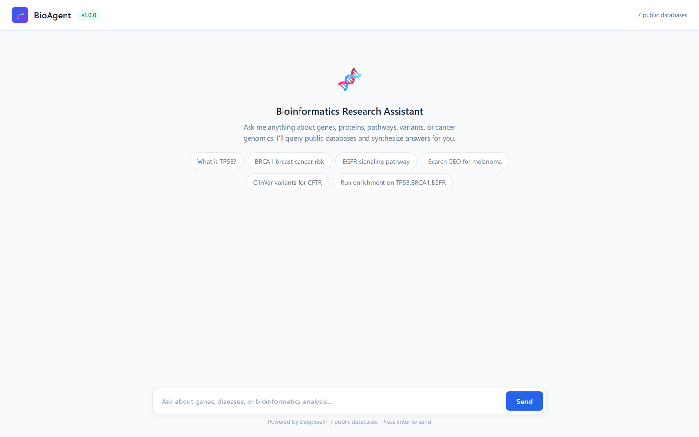
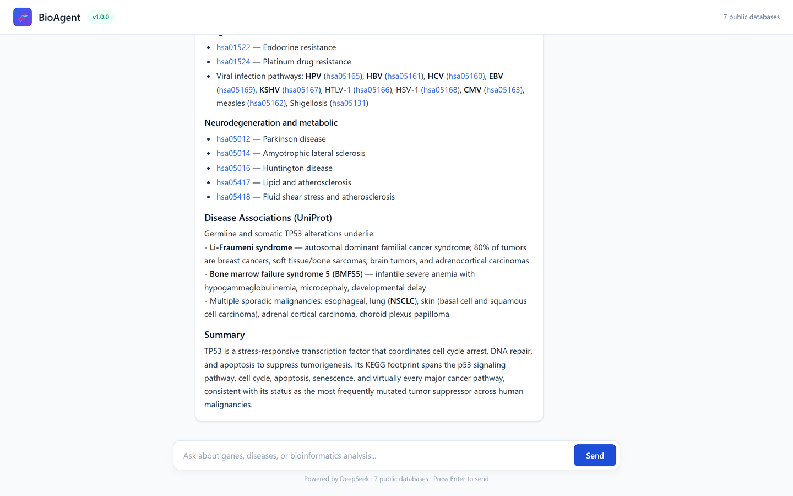

# BioAgent 🧬

**AI-Powered Bioinformatics Research Assistant**

> 中文简介:BioAgent 是一个基于大模型的生物信息科研助手。用自然语言对话即可查询 UniProt、Ensembl、KEGG、TCGA、GEO、ClinVar、dbSNP、STRING 等 10 个公共生物数据库,检索 PubMed 文献、做富集分析、解析本地 PDF 论文。支持 Claude / DeepSeek / GLM / Qwen / GPT 多家大模型,零 API 密钥即可使用全部工具。

Built with Python · FastAPI · Docker · 10 public bioinformatics APIs

[](https://www.python.org/downloads/)
[](LICENSE)
[](https://docs.docker.com/compose/)

BioAgent combines a large language model with a registry of bioinformatics tools. Ask questions in natural language — the agent autonomously decides which databases to query, executes the calls, and synthesizes an evidence-based answer with citations. A full real transcript: [`docs/demo_output.md`](docs/demo_output.md).

---

## Architecture

```
                 ┌────────────┬─────────────┬──────────────┐
                 │  Web UI    │  CLI -q     │  Python API  │
                 │ (FastAPI)  │ (single     │  (import     │
                 │            │  query)     │   BioAgent)  │
                 └──────┬─────┴──────┬──────┴───────┬──────┘
                        │            │              │
                        ▼            ▼              ▼
                 ┌──────────────────────────────────────┐
                 │        BioAgent Core (agent.py)      │
                 │  • tool-calling loop (max 8 turns)   │
                 │  • conversation history (window 20)  │
                 │  • provider abstraction              │
                 └──────────┬───────────────┬───────────┘
                 ┌──────────▼──────────┐ ┌──▼─────────────────┐
                 │  Anthropic Claude   │ │  OpenAI-compatible │
                 │  (native tools API) │ │  DeepSeek/GLM/Qwen │
                 └──────────┬──────────┘ └──┬─────────────────┘
                            │               │
                            ▼               ▼
                 ┌──────────────────────────────────────┐
                 │      Tool Registry (12 tools)        │
                 │   one schema → both API formats      │
                 └─┬──┬──┬──┬──┬──┬──┬──┬──┬──┬──┬──┬───┘
                   │  │  │  │  │  │  │  │  │  │  │  │
         UniProt Ensembl KEGG cBioPortal GEO ClinVar dbSNP STRING PubMed g:Profiler PDF
```

## Features

### 12 Agent Tools — all free public APIs, no keys required

| Tool | Data source | What it does |
|------|-------------|--------------|
| `query_uniprot` | UniProt REST | Protein function, domains, disease associations (human-filtered) |
| `query_ensembl` | Ensembl REST | Genomic annotation: location, biotype, transcripts |
| `query_kegg` | KEGG REST | Pathways, gene orthologs, disease entries |
| `query_tcga` | cBioPortal API | Cancer mutation data and mutation types |
| `query_geo` | NCBI GEO | Public expression dataset search |
| `query_clinvar` | NCBI ClinVar | Clinically significant variants by gene |
| `query_dbsnp` | NCBI dbSNP | SNPs by gene symbol or rsID |
| `query_string_network` | STRING API | Protein-protein interaction network with channel scores |
| `query_string_enrichment` | STRING API | Functional enrichment (GO/KEGG/Reactome/Diseases…) with FDR |
| `search_pubmed` | NCBI PubMed | Literature search with field qualifiers and real total counts |
| `run_enrichment` | g:Profiler REST | GO/KEGG/Reactome enrichment with p-values and FDR |
| `read_paper` | PyMuPDF / pypdf | Extract text, abstract and gene symbols from local PDFs |

### LLM Providers

| Provider | Mode |
|----------|------|
| Anthropic Claude | native `tools` API |
| DeepSeek (default) | OpenAI-compatible function calling |
| GLM / Qwen / Moonshot / GPT | OpenAI-compatible (set `OPENAI_BASE_URL`) |

### Interfaces

- **Web UI** — FastAPI + vanilla JS (default mode; `python -m src.cli`)
- **CLI** — single-query mode: `python -m src.cli -q "..."`
- **Python API** — `from src.agent import BioAgent`; direct tool calls available too

## Screenshots

| Welcome screen | Live answer (TP53 → UniProt + KEGG + Ensembl) |
|---|---|
|  |  |

## Quick Start

```bash
# 1. Clone & install
git clone https://github.com/yinyinglv0-lab/BioAgent.git
cd BioAgent
pip install -r requirements.txt

# 2. Configure (DeepSeek is free to start)
cp .env.example .env
#   Edit .env -> OPENAI_API_KEY=sk-xxx   (https://platform.deepseek.com/)
#   Or switch provider: AGENT_PROVIDER=anthropic + ANTHROPIC_API_KEY

# 3. Single query
python -m src.cli -q "Analyze TP53: molecular function, pathways, clinically significant variants"

# 4. Web UI
python -m src.cli --web --port 8000     # open http://localhost:8000

# 5. Docker
docker compose up
```

## Demo (real output)

```
$ python -m src.cli -q "Analyze TP53: its molecular function, key signaling
  pathways, and clinically significant variants. Cite key literature."

BioAgent v1.0.0 | Provider: openai | Model: deepseek-chat
============================================================
# TP53 (p53) — Integrated Analysis

## 1. Molecular Function
**Protein:** Cellular tumor antigen p53 (UniProt **P04637**, *P53_HUMAN*), 393 amino acids.
TP53 encodes a **multifunctional sequence-specific transcription factor** ...
  - **Cell cycle arrest** — via transcriptional activation of *CDKN1A* (p21)
  - **Apoptosis** — through pro-apoptotic targets (*BAX*, *PUMA/BBC3*, ...)

## 2. Key Signaling Pathways (KEGG)
| Pathway | KEGG ID | Role of p53 |
|---|---|---|
| **p53 signaling pathway** | hsa04115 | Core effector pathway |
| **Cell cycle** | hsa04110 | G1/S and G2/M checkpoint control via p21 |
...

## 5. Key Literature
| p53 structure–DNA complex | Cho et al., *Science* 1994 | PMID 8023157 |
| p53 in context (review)   | Kastenhuber & Lowe, *Cell* 2017 | PMID 28886379 |
```

Full transcript: [`docs/demo_output.md`](docs/demo_output.md) — the agent called UniProt, Ensembl, KEGG and PubMed autonomously and synthesized the answer with PMIDs.

## Project Structure

```
BioAgent/
├── src/
│   ├── agent.py              # Core agent: tool-calling loop, provider abstraction
│   ├── config.py             # env-based configuration (provider/model/tokens)
│   ├── cli.py                # CLI: single query, web server launcher
│   ├── web.py                # FastAPI server + web UI
│   └── tools/
│       ├── __init__.py       # Tool registry: one schema → Anthropic/OpenAI formats
│       ├── external_dbs.py   # UniProt, Ensembl, KEGG, cBioPortal, GEO, ClinVar, dbSNP, STRING
│       ├── web_search.py     # PubMed (NCBI E-utilities)
│       ├── enrichment.py     # g:Profiler functional enrichment
│       └── pdf_reader.py     # Local PDF paper extraction
├── docs/
│   ├── demo_output.md        # Full real agent transcript
│   └── 技术解析与面试问答.md    # Design deep-dive (Chinese)
├── examples/
│   ├── workflow.py           # Direct tool demo + agent conversation demo
│   └── pdf_analysis.py       # PDF paper analysis example
├── tests/test_tools.py       # Registry + live API tests
├── static/                   # Web UI assets
├── Dockerfile / docker-compose.yml
└── requirements.txt
```

## Tech Stack

| Layer | Technology |
|-------|-----------|
| LLM | Anthropic Messages API, OpenAI-compatible APIs (DeepSeek/GLM/Qwen/GPT) |
| Language | Python 3.11+ |
| Web | FastAPI + Uvicorn, vanilla JS frontend |
| Data | Pandas, NumPy, Matplotlib, Seaborn |
| PDF | PyMuPDF (fitz), pypdf fallback |
| Container | Docker + Docker Compose |
| External APIs | NCBI E-utilities (PubMed/GEO/ClinVar/dbSNP), UniProt, Ensembl, KEGG, cBioPortal, STRING, g:Profiler |

## Design Decisions

**1. Native tool calling, not LangChain.** LangChain adds abstraction overhead for a simple tool-calling loop. BioAgent talks to the provider APIs directly (~200-line core agent) and keeps full control over schemas, history and error handling.

**2. Provider-agnostic tool registry.** Each tool is one function + one JSON Schema, registered once. `get_tools_anthropic()` / `get_tools_openai()` convert the same registry to each provider's format — switching providers requires zero tool changes.

**3. Errors as data.** Every tool returns structured results, and every failure returns `{"error": ...}` instead of raising. The agent reads the error, explains the limitation to the user, and offers alternatives (e.g. fall back to another database).

**4. Zero-key tools.** All 10 data sources are public REST APIs requiring no API keys — only the LLM needs a key (DeepSeek offers free credits).

**5. Windows robustness.** `cli.py` forces UTF-8 stdout (default GBK encoding corrupts output when redirected), and all HTTP calls use certifi's CA bundle (default Windows CA list fails on some hosts).

## Testing

```bash
pip install pytest
pytest tests/ -q        # 7 tests: registry + live API smoke tests
```

## Roadmap

- [ ] Streamlit public deployment (shareable link)
- [ ] Streaming responses in the web UI
- [ ] RAG over local paper collections
- [ ] E-utilities rate-limit-aware throttling

## License

MIT

---

Built with Claude Code — an AI-powered development tool that assisted throughout the development lifecycle, from architecture design to implementation and testing.
